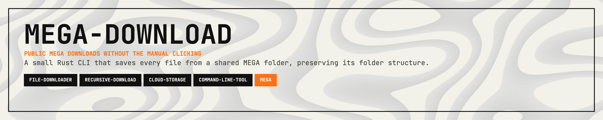

<p align="center">
  
</p>

<p align="center">
  <a href="https://crates.io/crates/mega-download"></a>
  <a href="https://crates.io/crates/megalib"></a>
  <a href="https://mega.nz"></a>
  <a href="https://git.woldtech.nl/woldtech/mega/mega-download/pulls"></a>
</p>

<p align="center">
  <a href="#features">Features</a> · <a href="#installation">Installation</a> · <a href="#quickstart">Quickstart</a> · <a href="#running-the-cli-examples">Running the CLI Examples</a> · <a href="#documentation">Documentation</a> · <a href="#contributing">Contributing</a> · <a href="#support">Support</a> · <a href="#license">License</a>
</p>

---

Download all files from a public MEGA folder, including subfolders. Uses [megalib](https://github.com/11philip22/megalib) (no login required).

## Features

- Download every file from a public MEGA folder recursively
- Preserve the remote folder structure locally
- Skip files that already exist on disk
- Run as a simple Rust CLI with no login required

## Installation

```bash
cargo install mega-download
```

## Quickstart

```bash
mega-download <FOLDER_URL> [OUTPUT_DIR]
```

## Running the CLI Examples

```bash
# Run from a local checkout
cargo run -- "https://mega.nz/folder/ABC123#key"

# Download to current directory with the installed binary
mega-download "https://mega.nz/folder/ABC123#key"

# Download to a specific directory
mega-download "https://mega.nz/folder/ABC123#key" ./downloads
```

## Documentation

- Command format: `mega-download <FOLDER_URL> [OUTPUT_DIR]`
- `FOLDER_URL`: a public MEGA folder link
- `OUTPUT_DIR`: optional destination directory, defaults to the current directory
- Existing files are skipped instead of downloaded again

## Contributing

Contributions are welcome! Please feel free to submit a Pull Request.

1. Fork the repository
2. Create your feature branch (`git checkout -b feature/cool-feature`)
3. Commit your changes (`git commit -m 'Add some cool feature'`)
4. Push to the branch (`git push origin feature/cool-feature`)
5. Open a Pull Request

## Support

If this crate saves you time or helps your work, support is appreciated:

[](https://ko-fi.com/11philip22)

## License

This project is licensed under the MIT License; see the [license](https://opensource.org/licenses/MIT) for details.
